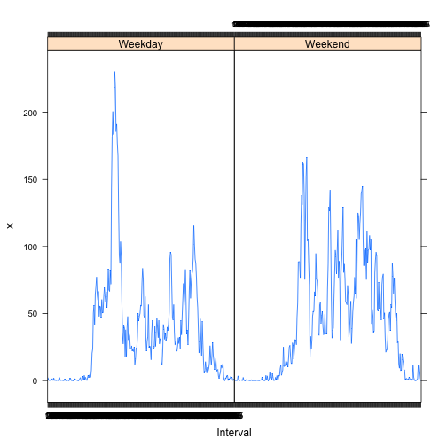

---
title: "PA1_template.Rmd"
author: "Paul Nakonechny"
date: "August 11, 2014"
output: html_document
---  
  
  
Reproducible Research: Peer Assessment 1
============================================
  
  
**Loading and preprocessing the data**

```r
setwd("~/RepData_PeerAssessment1")
unzip("~/RepData_PeerAssessment1/activity.zip")
data <- read.csv("./activity.csv")
data$date <- as.Date(data$date)
data$interval <- as.factor(data$interval)
```
  
  
**What is mean total number of steps taken per day?**


```r
StepsPerDay <- aggregate(data$steps, list(data$date), sum)
```
  
  
*1. Make a histogram of the total number of steps taken each day*

```r
hist(StepsPerDay$x, breaks = 20, main = "Total Number of Steps Taken Each Day")
```

 
  
  
*2. Calculate and report the mean and median total number of steps taken per day*

```r
stepsmean <- mean(StepsPerDay$x, na.rm = TRUE)

stepsmedian <- median (StepsPerDay$x, na.rm = TRUE)
```
The mean total number of steps taken per day is  1.0766 &times; 10<sup>4</sup>  
The median total number of steps taken per day is 10765
  
  
**What is the average daily activity pattern?**  

```r
meanBYinterval <- tapply(data$steps, data$interval, FUN = mean, na.rm = TRUE)
```
  
  
*Make a time series plot (i.e. type = "l") of the 5-minute interval (x-axis) and the average number of steps taken, averaged across all days (y-axis)*


```r
plot(unique(data$interval), meanBYinterval, type = "l", 
     main = "Average Number of Steps Taken", xlab = "Interval", 
     ylab = "Average Number of Steps")
```

 
  
  
*Which 5-minute interval, on average across all the days in the dataset, contains the maximum number of steps?*

```r
meanBYinterval <- as.data.frame(meanBYinterval)
meanBYinterval$interval <- as.character(unique(data$interval))
maxmean <- meanBYinterval[which.max(meanBYinterval$meanBYinterval), 2] 
maxmean
```

```
## [1] "835"
```

The 835th interval, on average across all the days in the dataset, contains the maximum number of steps.
  
  
**Imputing missing values**  
*Note that there are a number of days/intervals where there are missing values (coded as NA). The presence of missing days may introduce bias into some calculations or summaries of the data.*  

*1. Calculate and report the total number of missing values in the dataset (i.e. the total number of rows with NAs)*  

```r
incomplete <- sum(complete.cases(data) == FALSE)
incomplete
```

```
## [1] 2304
```
There are 2304 rows with NA values.  
  
  
*2. Devise a strategy for filling in all of the missing values in the dataset. The strategy does not need to be sophisticated. For example, you could use the mean/median for that day, or the mean for that 5-minute interval, etc.*  
  
  
Strategy: Replace missing values with the mean for a given interval.

*3. Create a new dataset that is equal to the original dataset but with the missing data filled in.*

```r
newdata <- data

for(i in 1:17568) {
  if(is.na(newdata$steps[i])){
    newdata$steps[i] <- meanBYinterval$meanBYinterval[newdata$interval[i] == 
                                                      meanBYinterval$interval]
  }
}
```
  
  
*4. Make a histogram of the total number of steps taken each day:*  

```r
newStepsPerDay <- aggregate(newdata$steps, list(newdata$date), sum)
hist(newStepsPerDay$x, breaks = 20, main = "Total Number of Steps Taken Each Day")
```

 
  
  
*Calculate and report the mean and median total number of steps taken per day.* 


```r
newstepsmean <- mean(newStepsPerDay$x)
newstepsmedian <- median(newStepsPerDay$x)
```

The mean total number of steps taken per day is  1.0766 &times; 10<sup>4</sup>  
The median total number of steps taken per day is 1.0766 &times; 10<sup>4</sup>
  
  
*Do these values differ from the estimates from the first part of the assignment?* 

```r
newstepsmean == stepsmean
```

```
## [1] TRUE
```

```r
newstepsmedian == stepsmedian  
```

```
## [1] FALSE
```

*What is the impact of imputing missing data on the estimates of the total daily number of steps?*   

Aside from the changes noted above:


```r
oldsd <- sd(StepsPerDay$x, na.rm = TRUE)
newsd <- sd(newStepsPerDay$x)
```
The standard deviation of the original dataset is 4269.1805
The standard deviation of the new dataset is 3974.3907
  
  
**Are there differences in activity patterns between weekdays and weekends?**  

*1. Create a new factor variable in the dataset with two levels – “weekday” and “weekend” indicating whether a given date is a weekday or weekend day.*

```r
for(i in 1:17568) {
  newdata$weekday[i] <- weekdays(newdata$date[i])
}

for(i in 1:17568) {
if(newdata$weekday[i] == "Saturday" | (newdata$weekday[i] == "Sunday")){
  newdata$weekday[i] <- "Weekend"
} else{newdata$weekday[i] <- "Weekday"
      }
}
newdata$weekday <- as.factor(newdata$weekday)
```

  
*2. Make a panel plot containing a time series plot (i.e. type = "l") of the 5-minute interval (x-axis) and the average number of steps taken, averaged across all weekday days or weekend days (y-axis).*


```r
require(lattice)
?aggregate
finaldata <- aggregate(newdata$steps, list(newdata$interval, newdata$weekday), mean)
xyplot(x ~ Group.1 | Group.2, finaldata, xlab = "Interval", type = "l")
```

 

